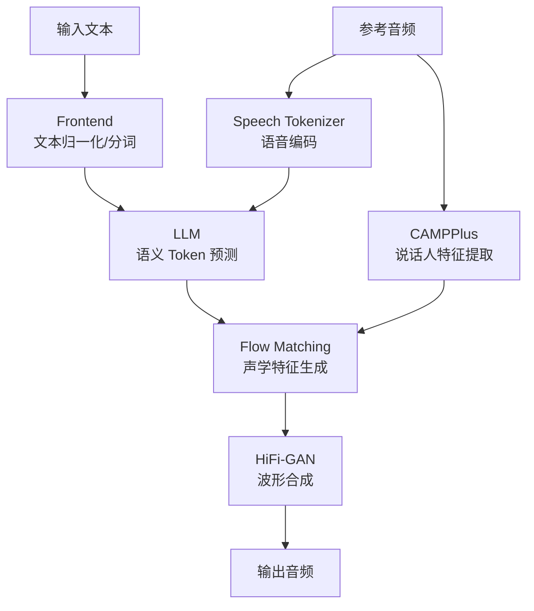

# CosyVoice 项目分析

## 概览

**CosyVoice** 是阿里巴巴通义实验室 (FunAudioLLM) 开源的**基于大语言模型的生成式语音合成 (TTS) 系统**，支持多语种零样本语音合成。

项目已迭代三个大版本：**CosyVoice 1.0 → 2.0 → Fun-CosyVoice 3.0**。

---

## 核心能力

| 能力 | 说明 |
|------|------|
| **预训练音色 (SFT)** | 使用内置预训练说话人音色直接合成 |
| **3s 极速复刻 (Zero-Shot)** | 仅需 3 秒参考音频即可克隆音色 |
| **跨语种复刻 (Cross-Lingual)** | 用 A 语言参考音频合成 B 语言语音 |
| **自然语言控制 (Instruct)** | 通过文本指令控制方言/情感/语速等 |
| **语音转换 (VC)** | 将源语音转为目标说话人音色 |
| **双向流式 (Bi-Streaming)** | 文本流式输入 + 音频流式输出，延迟低至 150ms |
| **发音修正 (Hotfix)** | 支持拼音/CMU 音素注入修正发音 |

**语言覆盖**：中/英/日/韩/德/西/法/意/俄 9 种语言 + 18+ 种中文方言

---

## 架构



### 核心模块 (`cosyvoice/`)

| 模块 | 路径 | 职责 |
|------|------|------|
| **CLI** | `cli/cosyvoice.py` | 顶层 API 入口，`AutoModel` 工厂函数自动识别模型版本 |
| **CLI Frontend** | `cli/frontend.py` | 文本前端：归一化、分句、tokenize |
| **CLI Model** | `cli/model.py` (27KB) | 模型编排层，组合 LLM + Flow + HiFi-GAN 完成推理 |
| **LLM** | `llm/llm.py` (36KB) | 自回归语言模型，生成语义 speech tokens |
| **Flow** | `flow/flow.py` + `flow_matching.py` + `decoder.py` | Conditional Flow Matching 声学模型 |
| **HiFi-GAN** | `hifigan/` | 神经声码器，mel→waveform |
| **Tokenizer** | `tokenizer/tokenizer.py` | 语音 tokenizer，将音频编码为离散 token |
| **Utils** | `utils/` | 训练/推理工具集：损失函数、mask、调度器、训练辅助等 |

### 类继承关系

```
CosyVoice (v1, cosyvoice.yaml)
  └── CosyVoice2 (v2, cosyvoice2.yaml) - 新增 instruct2, vllm 支持
        └── CosyVoice3 (v3, cosyvoice3.yaml) - 新增 DiT decoder, speech_tokenizer_v3

AutoModel() 工厂函数根据 yaml 文件自动选择对应类
```

---

## 已下载的预训练模型

| 模型 | 路径 | 大小 (核心文件) |
|------|------|----------------|
| **Fun-CosyVoice3-0.5B** | `pretrained_models/Fun-CosyVoice3-0.5B/` | llm.pt ~2GB, flow.pt ~1.3GB, hift.pt ~83MB |
| **CosyVoice2-0.5B** | `pretrained_models/CosyVoice2-0.5B/` | - |
| **CosyVoice-300M** | `pretrained_models/CosyVoice-300M/` | - |
| **CosyVoice-300M-SFT** | `pretrained_models/CosyVoice-300M-SFT/` | - |

> [!NOTE]
> CosyVoice3 还包含 `llm.rl.pt` (RL 后训练版本) 和 `flow.decoder.estimator.fp32.onnx` (TensorRT 导出用)。

---

## 入口文件

| 文件 | 用途 |
|------|------|
| `example.py` | 各版本模型的 Python 调用示例 (当前 main 只跑 cosyvoice3) |
| `webui.py` | Gradio Web UI，端口默认 8000，支持 4 种推理模式 |
| `vllm_example.py` | CosyVoice2 的 vLLM 加速推理示例 |

---

## 推理加速选项

| 方式 | 适用版本 | 说明 |
|------|---------|------|
| **JIT (TorchScript)** | v1, v2 | 编译 text_encoder / llm / flow.encoder |
| **TensorRT** | v1, v2, v3 | flow.decoder 导出为 TRT plan |
| **vLLM** | v2, v3 | LLM 部分用 vLLM 推理 (需 vllm==0.9.0) |
| **FP16** | 全版本 | 半精度推理 |

---

## 部署架构

```
runtime/
├── python/          # Python 运行时
│   ├── grpc/        # gRPC server/client
│   └── fastapi/     # FastAPI server/client
└── triton_trtllm/   # NVIDIA Triton + TensorRT-LLM (4x 加速)
```

Docker 部署：`docker/` 目录提供 Dockerfile。

---

## 训练支持

`examples/` 目录提供训练脚本：

| 目录 | 内容 |
|------|------|
| `examples/libritts/` | LibriTTS 数据集训练配置 |
| `examples/magicdata-read/` | MagicData 中文数据集训练配置 |
| `examples/grpo/` | GRPO (RL) 训练，用于 CosyVoice3 后训练 |

---

## 关键依赖

- **PyTorch 2.3.1** + torchaudio
- **Transformers 4.51.3** (Qwen backbone)
- **Gradio 5.4.0** (WebUI)
- **DeepSpeed 0.15.1** (训练加速, Linux only)
- **ONNX Runtime** (speech tokenizer / campplus 推理)
- **Matcha-TTS** (`third_party/`) — Flow Matching 基础实现

---

## 当前状态总结

> [!IMPORTANT]
> - 4 个预训练模型已全部下载到位，可以直接运行推理
> - `webui.py` 默认使用 `CosyVoice3-0.5B`，需 GPU 环境
> - 项目根目录下已有多个 `.wav` 文件，说明之前已成功运行过推理
