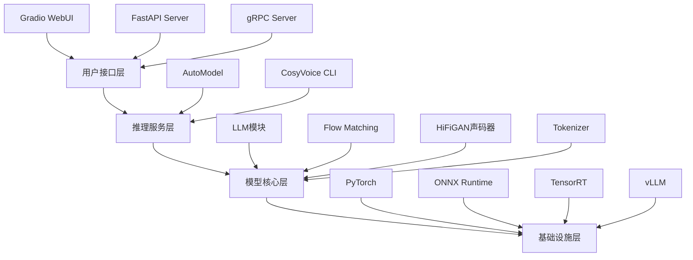

# CosyVoice 系统分析报告

## 📋 系统概述

**CosyVoice** 是阿里巴巴通义实验室开发的**生成式语音大模型**系统，基于大语言模型(LLM)的先进文本转语音(TTS)技术。该系统支持零样本多语言语音合成，具备高度的自然度和说话人相似度。

### 版本演进

- **CosyVoice 1.0** (300M参数) - 基础版本
- **CosyVoice 2.0** (0.5B参数) - 支持流式推理
- **Fun-CosyVoice 3.0** (0.5B参数) - 最新版本，性能显著提升

---

## 🏗️ 系统架构

### 核心组件层次结构



---

## 📦 目录结构分析

### 主要目录

| 目录 | 功能 | 重要文件 |
|------|------|----------|
| [cosyvoice/](file://10.255.1.115/CosyVoice/example.py#7-34) | 核心代码库 | 模型、推理、工具类 |
| `cosyvoice/cli/` | 命令行接口 | `cosyvoice.py`, `frontend.py`, `model.py` |
| `cosyvoice/llm/` | 大语言模型 | LLM推理逻辑 |
| `cosyvoice/flow/` | Flow Matching | 声学模型 |
| `cosyvoice/hifigan/` | 声码器 | 音频生成 |
| `cosyvoice/tokenizer/` | 分词器 | 文本处理 |
| `cosyvoice/utils/` | 工具函数 | 文件处理、日志等 |
| `runtime/` | 部署运行时 | Docker、服务器脚本 |
| `runtime/python/fastapi/` | FastAPI服务 | `server.py`, `client.py` |
| `runtime/python/grpc/` | gRPC服务 | 高性能RPC |
| `runtime/triton_trtllm/` | TensorRT加速 | GPU优化部署 |
| `examples/` | 训练示例 | GRPO、LibriTTS数据集 |
| `third_party/` | 第三方依赖 | Matcha-TTS等 |
| `pretrained_models/` | 预训练模型 | 模型权重文件 |

---

## 🔧 核心功能模块

### 1. 模型类 (cosyvoice/cli/cosyvoice.py)

#### CosyVoice (v1.0)
```python
class CosyVoice:
    - inference_sft()           # 预训练音色推理
    - inference_zero_shot()     # 3秒极速复刻
    - inference_cross_lingual() # 跨语种复刻
    - inference_instruct()      # 自然语言控制
    - inference_vc()            # 语音转换
```

#### CosyVoice2 (v2.0)
```python
class CosyVoice2(CosyVoice):
    - inference_instruct2()     # 增强指令推理
    - 支持 vLLM 加速
    - 支持流式推理
```

#### CosyVoice3 (v3.0)
```python
class CosyVoice3(CosyVoice2):
    - 9种常见语言支持
    - 18+种中文方言/口音
    - 发音修复(Hotfix)
    - 双向流式(文本输入+音频输出)
    - 低延迟(150ms)
```

### 2. 推理模式

| 模式 | 中文名称 | 功能描述 | 所需输入 |
|------|----------|----------|----------|
| **SFT** | 预训练音色 | 使用预训练说话人 | 文本 + 说话人ID |
| **Zero-Shot** | 3秒极速复刻 | 克隆新说话人 | 文本 + Prompt文本 + Prompt音频 |
| **Cross-Lingual** | 跨语种复刻 | 跨语言克隆 | 文本 + Prompt音频 |
| **Instruct** | 自然语言控制 | 指令控制风格 | 文本 + 说话人ID + 指令文本 |
| **Instruct2** | 增强指令 | 结合音频的指令 | 文本 + 指令 + Prompt音频 |
| **VC** | 语音转换 | 音色转换 | 源音频 + 目标音频 |

### 3. 部署服务

#### FastAPI 服务器 (runtime/python/fastapi/server.py)

**特点:**
- RESTful API接口
- 支持跨域(CORS)
- 流式响应
- 临时文件自动清理

**API端点:**
```
POST /inference_sft
POST /inference_zero_shot
POST /inference_cross_lingual
POST /inference_instruct
POST /inference_instruct2
```

**配置:**
- 主机: `10.255.1.115`
- 默认端口: `50000`
- 自动检测模型类型(CosyVoice/CosyVoice2)

#### Gradio WebUI (webui.py)

**功能:**
- 可视化交互界面
- 实时音频录制
- 音频文件上传
- 流式/非流式切换
- 语速调节(0.5-2.0倍)
- 随机种子控制

**界面元素:**
- 文本输入框
- 推理模式选择
- 预训练音色下拉菜单
- Prompt音频上传/录制
- 指令文本输入
- 生成音频播放器

---

## 🧠 技术栈

### 深度学习框架
- **PyTorch 2.3.1** - 主框架
- **TorchAudio 2.3.1** - 音频处理
- **Transformers 4.51.3** - LLM支持

### 推理加速
- **ONNX Runtime 1.18.0** - 跨平台推理
- **TensorRT 10.13.3** - NVIDIA GPU加速
- **vLLM 0.9.0** - LLM推理优化

### Web服务
- **FastAPI 0.115.6** - 异步Web框架
- **Uvicorn 0.30.0** - ASGI服务器
- **Gradio 5.4.0** - 快速原型界面
- **gRPC 1.57.0** - 高性能RPC

### 音频处理
- **librosa 0.10.2** - 音频分析
- **soundfile 0.12.1** - 音频读写
- **pyworld 0.3.4** - 声学特征提取

### 其他关键依赖
- **DeepSpeed 0.15.1** - 分布式训练(Linux)
- **Lightning 2.2.4** - 训练框架
- **Hydra 1.3.2** - 配置管理
- **WeText 0.0.4** - 文本归一化

---

## 🚀 部署方案

### 1. Docker部署

```bash
cd runtime/python
docker build -t cosyvoice:v1.0 .

# FastAPI部署
docker run -d --runtime=nvidia -p 50000:50000 cosyvoice:v1.0 \
  /bin/bash -c "cd /opt/CosyVoice/CosyVoice/runtime/python/fastapi && \
  python3 server.py --port 50000 --model_dir iic/CosyVoice-300M"

# gRPC部署
docker run -d --runtime=nvidia -p 50000:50000 cosyvoice:v1.0 \
  /bin/bash -c "cd /opt/CosyVoice/CosyVoice/runtime/python/grpc && \
  python3 server.py --port 50000 --max_conc 4 --model_dir iic/CosyVoice-300M"
```

### 2. TensorRT-LLM加速部署

```bash
cd runtime/triton_trtllm
docker compose up -d
```

**性能提升:** 相比HuggingFace Transformers实现，LLM推理速度提升**4倍**

### 3. 本地开发部署

```bash
# WebUI启动
python3 webui.py --port 50000 --model_dir pretrained_models/CosyVoice-300M

# FastAPI启动
cd runtime/python/fastapi
python3 server.py --port 50000 --model_dir iic/CosyVoice-300M
```

---

## 📊 性能指标

### 模型对比 (基于CV3-Eval测试集)

| 模型 | 参数量 | 中文CER↓ | 中文相似度↑ | 英文WER↓ | 英文相似度↑ |
|------|--------|----------|-------------|----------|-------------|
| **Human** | - | 1.26% | 75.5% | 2.14% | 73.4% |
| Seed-TTS | - | 1.12% | 79.6% | 2.25% | 76.2% |
| F5-TTS | 0.3B | 1.52% | 74.1% | 2.00% | 64.7% |
| CosyVoice2 | 0.5B | 1.45% | 75.7% | 2.57% | 65.9% |
| **Fun-CosyVoice3** | 0.5B | **1.21%** | **78.0%** | **2.24%** | **71.8%** |
| **Fun-CosyVoice3-RL** | 0.5B | **0.81%** | 77.4% | **1.68%** | 69.5% |

> **CER**: Character Error Rate (字符错误率)  
> **WER**: Word Error Rate (单词错误率)  
> **相似度**: Speaker Similarity (说话人相似度)

### 延迟性能

- **标准推理**: ~500ms
- **流式推理**: 首包延迟 **150ms**
- **TensorRT加速**: 推理速度提升 **4倍**

---

## 🌍 多语言支持

### CosyVoice 3.0 语言覆盖

#### 9种主流语言
- 🇨🇳 中文 (Chinese)
- 🇺🇸 英文 (English)
- 🇯🇵 日文 (Japanese)
- 🇰🇷 韩文 (Korean)
- 🇩🇪 德文 (German)
- 🇪🇸 西班牙文 (Spanish)
- 🇫🇷 法文 (French)
- 🇮🇹 意大利文 (Italian)
- 🇷🇺 俄文 (Russian)

#### 18+种中文方言/口音
广东话、闽南话、四川话、东北话、陕西话、山西话、上海话、天津话、山东话、宁夏话、甘肃话等

---

## 🎯 核心特性

### 1. 文本归一化
- 自动处理数字、特殊符号
- 无需传统前端模块
- 支持 `ttsfrd` 或 `WeText`

### 2. 发音修复 (Hotfix)
- 支持中文拼音标注: `[j][ǐ]`
- 支持英文CMU音素
- 精确控制发音

### 3. 细粒度控制
```python
# 支持的控制标签
<laughter></laughter>  # 笑声
<strong></strong>      # 强调
[laughter]             # 笑声事件
[breath]               # 呼吸声
```

### 4. 流式推理
- **文本输入流**: 支持生成器输入
- **音频输出流**: 实时返回音频块
- **双向流**: 同时支持输入输出流

---

## 🔬 训练与微调

### GRPO训练 (examples/grpo/)
- **Group Relative Policy Optimization**
- 强化学习后训练
- 提升内容一致性和自然度

### 数据集支持
- **LibriTTS**: 英文语音数据集
- **MagicData-READ**: 中文阅读数据集
- 自定义数据集训练脚本

### 训练脚本位置
```
examples/libritts/cosyvoice/run.sh
examples/grpo/
```

---

## 🛠️ 工具与实用功能

### 模型下载
```python
# ModelScope (国内)
from modelscope import snapshot_download
snapshot_download('FunAudioLLM/Fun-CosyVoice3-0.5B-2512', 
                  local_dir='pretrained_models/Fun-CosyVoice3-0.5B')

# HuggingFace (海外)
from huggingface_hub import snapshot_download
snapshot_download('FunAudioLLM/Fun-CosyVoice3-0.5B-2512',
                  local_dir='pretrained_models/Fun-CosyVoice3-0.5B')
```

### 说话人管理
```python
# 列出可用说话人
cosyvoice.list_available_spks()

# 添加零样本说话人
cosyvoice.add_zero_shot_spk(prompt_text, prompt_wav, 'custom_spk_id')

# 保存说话人信息
cosyvoice.save_spkinfo()
```

---

## 🔐 系统要求

### 硬件要求
- **GPU**: NVIDIA GPU (CUDA 12.1)
- **显存**: 建议 ≥ 8GB
- **内存**: 建议 ≥ 16GB

### 软件要求
- **操作系统**: Linux (推荐) / Windows / macOS
- **Python**: 3.10
- **CUDA**: 12.1
- **依赖**: 见 `requirements.txt`

### 平台差异
- **Linux**: 完整支持 (DeepSpeed, ONNX Runtime GPU, TensorRT)
- **Windows/macOS**: 基础支持 (ONNX Runtime CPU)

---

## 📈 应用场景

1. **有声读物制作** - 长文本朗读
2. **虚拟主播/数字人** - 实时语音合成
3. **多语言配音** - 跨语言内容本地化
4. **个性化语音助手** - 定制音色
5. **游戏角色配音** - 情感控制
6. **教育培训** - 多语言教学
7. **无障碍服务** - 文本转语音辅助

---

## ⚠️ 注意事项

### 模型选择
- **CosyVoice-300M**: 基础零样本、跨语言
- **CosyVoice-300M-SFT**: 预训练音色
- **CosyVoice-300M-Instruct**: 自然语言控制
- **CosyVoice2-0.5B**: 流式推理、增强性能
- **Fun-CosyVoice3-0.5B**: 最佳性能、多语言

### 推理限制
- Prompt音频长度: ≤ 30秒
- Prompt音频采样率: ≥ 16kHz
- 跨语种模式需确保文本与Prompt为不同语言
- 自然语言控制仅支持 Instruct 模型

### 性能优化建议
1. 使用 **vLLM** 加速 LLM 推理
2. 使用 **TensorRT** 加速 Flow 模型
3. 启用 **流式推理** 降低首包延迟
4. 使用 **KV Cache** 优化 Transformer 推理
5. 批处理推理提升吞吐量

---

## 🔗 相关资源

### 官方链接
- **GitHub**: https://github.com/FunAudioLLM/CosyVoice
- **ModelScope**: https://www.modelscope.cn/models/iic/CosyVoice-300M
- **HuggingFace**: https://huggingface.co/FunAudioLLM
- **Demo**: https://funaudiollm.github.io/cosyvoice3/

### 论文引用
```bibtex
@article{du2025cosyvoice,
  title={CosyVoice 3: Towards In-the-wild Speech Generation via Scaling-up and Post-training},
  author={Du, Zhihao and Gao, Changfeng and Wang, Yuxuan and ...},
  journal={arXiv preprint arXiv:2505.17589},
  year={2025}
}
```

---

## 📝 总结

**CosyVoice** 是一个功能强大、架构清晰的**企业级TTS系统**，具备以下优势:

✅ **性能卓越** - 接近人类水平的合成质量  
✅ **多语言支持** - 9种语言 + 18+种方言  
✅ **灵活部署** - Docker/本地/TensorRT多种方案  
✅ **易于集成** - FastAPI/gRPC/Gradio多种接口  
✅ **持续演进** - 从1.0到3.0不断优化  
✅ **开源友好** - Apache 2.0协议，社区活跃

该系统适合**生产环境部署**，可满足从原型开发到大规模服务的各种需求。
